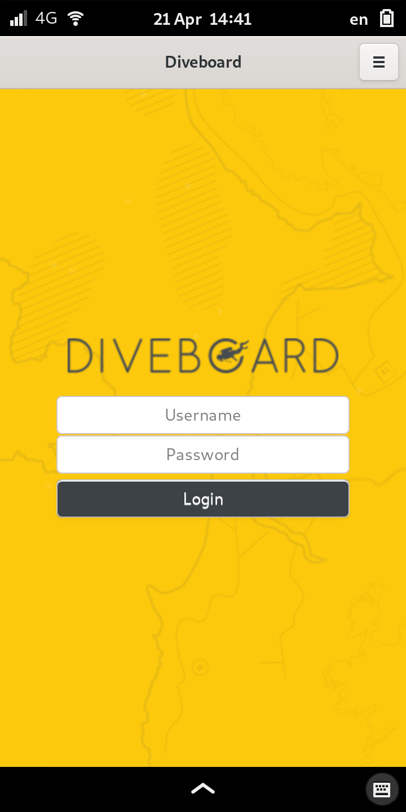
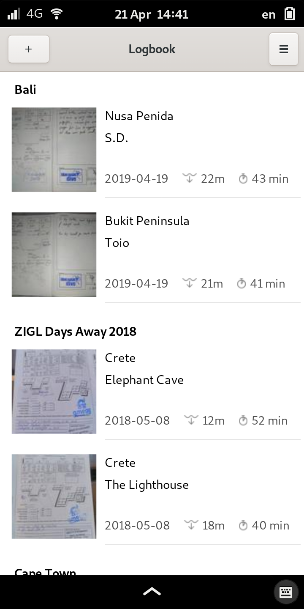
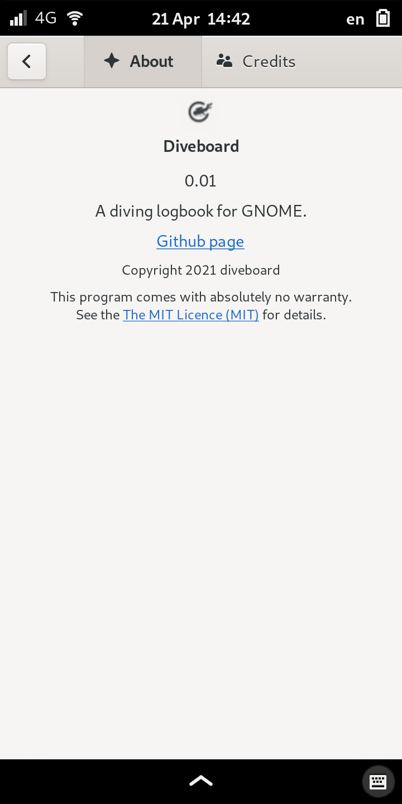

# Diveboard

GTK client for https://www.diveboard.com/ designed for Linux based mobiles like the PinePhone/Librem5.


## Building

### Requirements
- Python 3
- PyGObject
- libhandy (>= 1.2)
- Meson
- Ninja

### Building from Git
```
git clone https://gitea.slothlife.xyz/baarkerlounger/Diveboard-GTK.git
cd Diveboard-GTK
meson builddir --prefix=/usr/local
sudo ninja -C builddir install
```


### Screenshots

<br />
<br />

