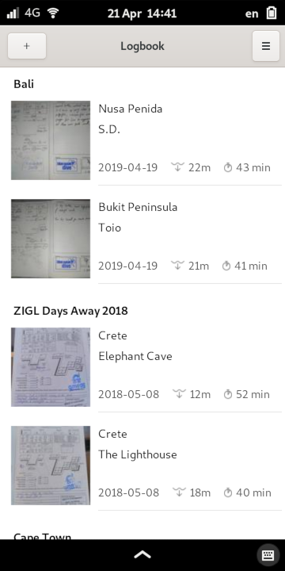
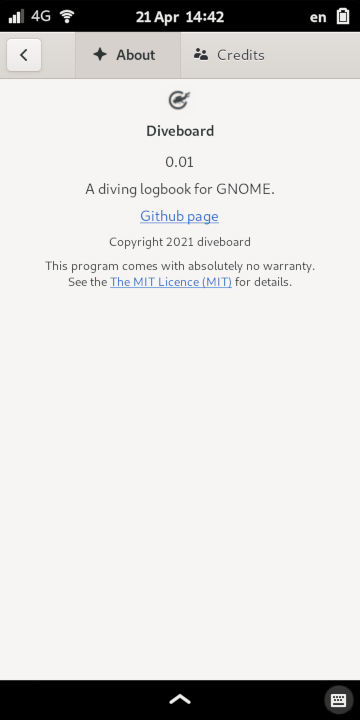

# Diveboard

GTK client for https://www.diveboard.com/ designed for Linux based mobiles like the PinePhone/Librem5. Currently barely functional and not remotely performant, it's really more of a WIP UI mockup. 


## Building

### Requirements
- Python 3
- PyGObject
- libadwaita 
- Meson
- Ninja
- libshumate

### Building from Git
```
git clone https://gitea.slothlife.xyz/baarkerlounger/Diveboard-GTK.git
cd Diveboard-GTK
meson builddir --prefix=/usr/local
sudo ninja -C builddir install
```


### Screenshots




